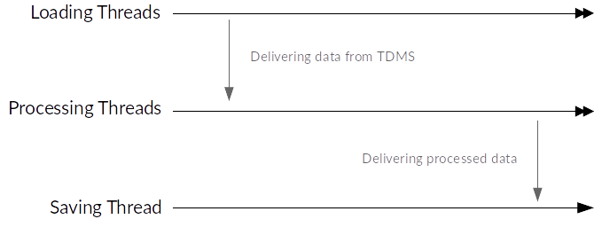
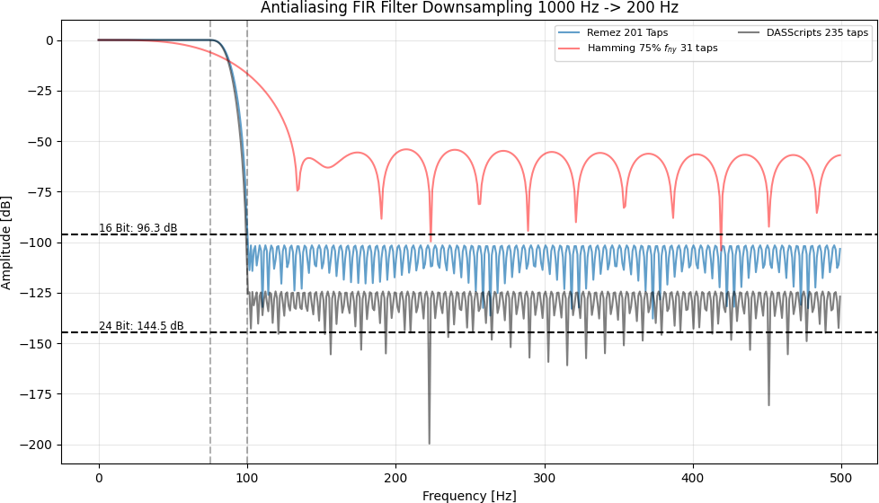
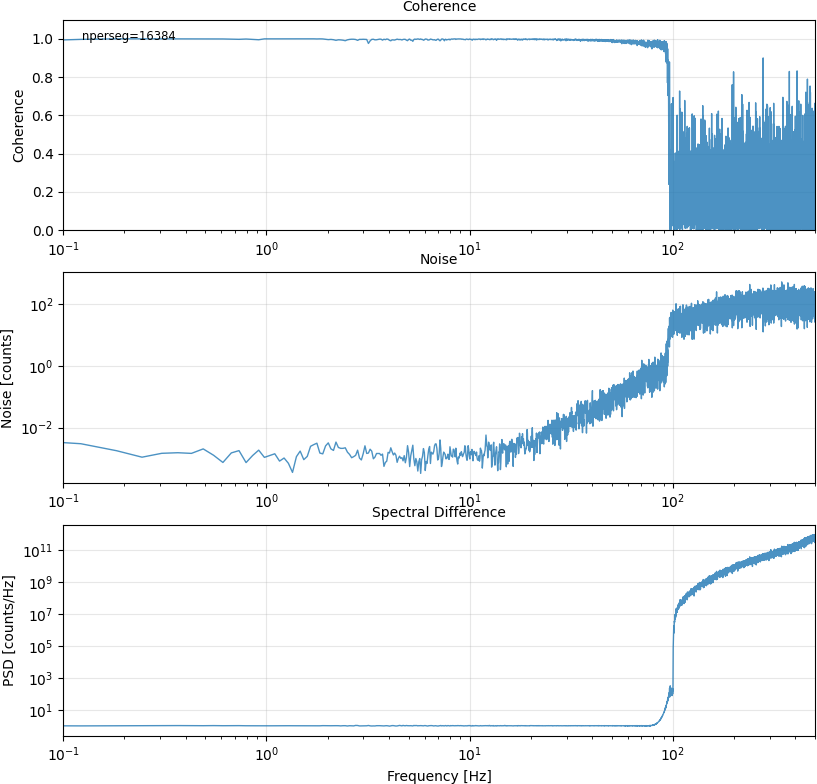

Processing details
==================

The command line tools take Silixa iDAS `TDMS <https://www.wiresmithtech.com/articles/what-is-a-tdms-file/>`_ data as input. The data are loaded and converted to MiniSeed in an efficient manner.

The conversion tool makes heavy use of multi-threading and CPython extensions for parallel I/O and downsampling of the time series data. By this approach we try circumventing the bad threading performance of Python due to its `GIL <https://wiki.python.org/moin/GlobalInterpreterLock>`_.

   Simple treading architecture of idas-convert.

Quality Control (QC)
--------------------

The conversion process has basic QC routines built-in

* Data gap detection.
* 0-Value detection.

These events are logged and written to a Pyrocko marker file, which can be loaded into Pyrocko's snuffler GUI for inspection.

Telegram bot
^^^^^^^^^^^^

The Telegram Bot can monitor lengthy conversion sessions. It will report all warnings and give regularl status updated on the progress of the conversion.

Downsampling
------------

Downsampling of the timeseries data uses an adaptive antialiasing FIR filter. The filter has a cut-off frequency of 75% Nyquist-frequency.

   Antialiasing FIR filter response used for down-sampling the data.

   Frequency analysis and comparison of converted 1 kHz data to downsampled 200 Hz MiniSeed timeseries.
